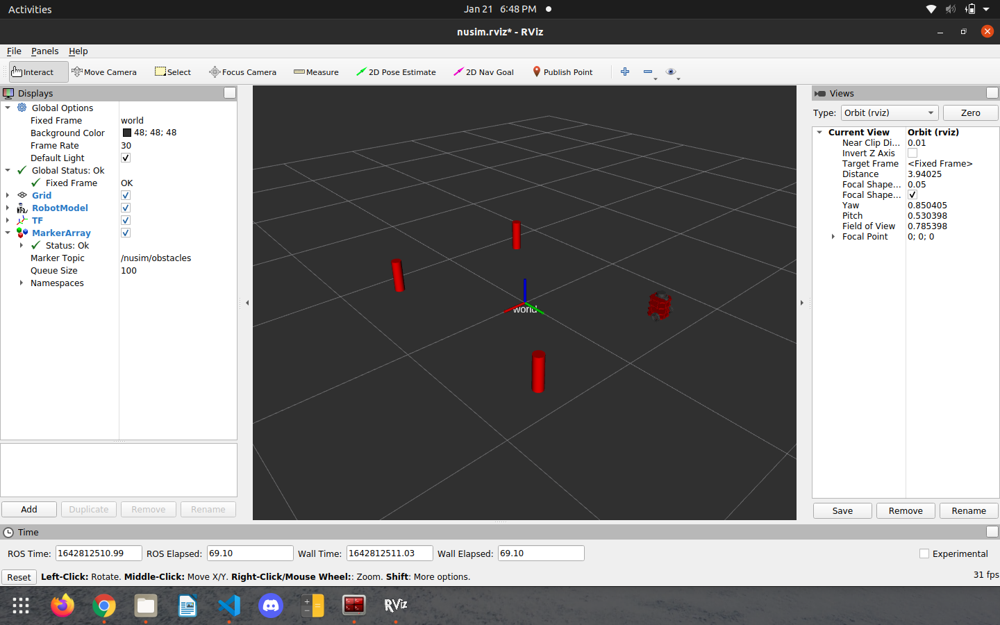

# NUSIM Package
## Creator
Cody Nichoson  
Winter 2022  
Northwestern University  
MS in Robotics

### Package Description
This package can be used as a simulator and visualizer for a single or multiple TurtleBots. It can also
display various obstacles around the robot(s).

### Launchfiles
#### `nusim.launch`
Launch this package using `roslaunch nusim nusim.launch` to display a single TurtleBot along with several obstacles.

### Parameters
If you wish to change the starting location of the robot, the number of obstacles, or the size of obstacles, change
the corresponding values located in nusim/config/basic_world.yaml. The variables and their default values are as follows:

#### rate: 500
#### radius: 0.038
#### height: 0.25
#### obs_x: [-0.6, 0.6, 0.6]
#### obs_y: [-0.8, -0.8, 0.8]
#### robot_start_x: -0.6
#### robot_start_y: 0.8
#### robot_start_theta: 1.57

### Screenshot
